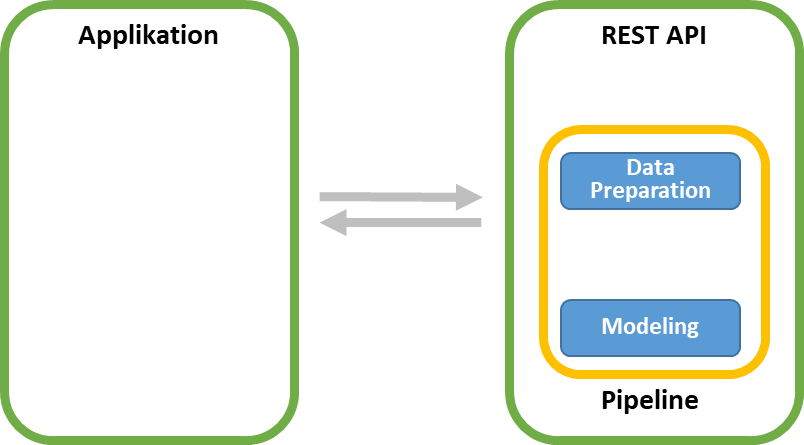
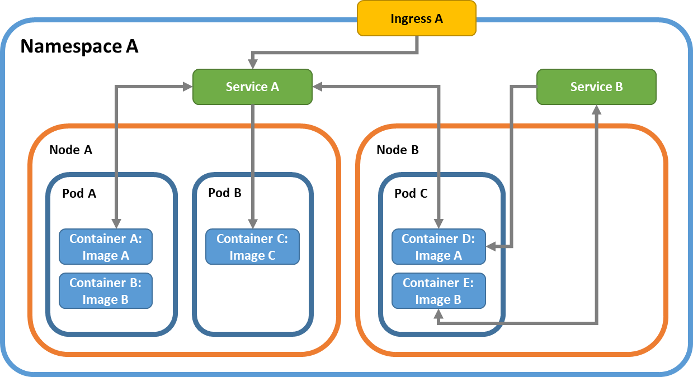
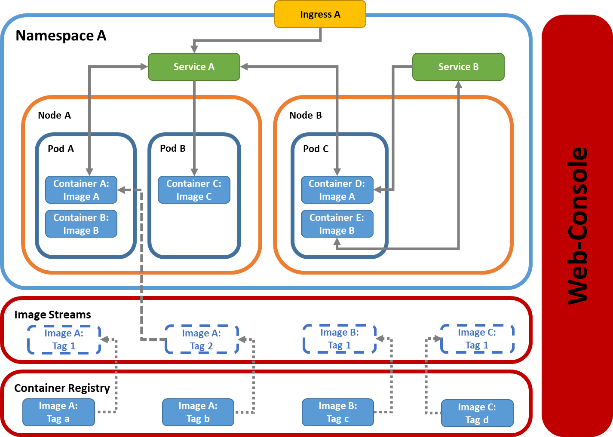

# Kubernetes Deployment von Machine Learning Modellen

1. [Modell Integration?](#modell_integration)
2. [Machine Learning Beispiel Modell](#model)
3. [Reproduzierbare Data-Science](#repo_ds)
3. [Swagger-API mit Flask](#flask)
4. [Kubernetes & OpenShift](#kubernetes)
5. [Deployment](#deploy)
6. [Unittest, Vulnerability Checks mit Python](#checks)

## <a name="modell_integration">Modell Integration</a>
Neben der Aufbereitung der Daten ist die größte Herausforderung in Machine Learning Projekten das Bereitstellen des Modells in produktiven Umgebungen, vgl. [Google Rules for ML](https://developers.google.com/machine-learning/guides/rules-of-ml/).

2017 hat [Python](https://www.python.org/) [R](https://www.r-project.org/) als Sprache der Data Science laut einer [KDNuggets Umfrage](https://www.kdnuggets.com/2017/08/python-overtakes-r-leader-analytics-data-science.html) überholt. 
Java dominiert jedoch die Banken IT, wenn auch Python [bei Fintechs seit einiger Zeit beliebter](https://blog.hackerrank.com/emerging-languages-still-overshadowed-by-incumbents-java-python-in-coding-interviews/) zu sein scheint.

Ziel ist es eine API bereitzustellen, die neben dem reinen Modell, wie einem Decision Tree, einer Support Vector Machine oder einem Neuronalen Netz, auch Komponentes des Feature Engineerings übernimmt, wie z.B. die Geokodierung von Adressen o.ä..


## <a name="model">Modell</a>

Im Beispiel Code wird ein Machine Learning Modell auf den [Iris-Datensatz](https://en.wikipedia.org/wiki/Iris_flower_data_set) angewendet. Aufgabe ist es, anhand der Längen und Breiten der Kelch- (Sepalen) und Kronblätter (Petalen) die folgenden drei Lilien zu unterscheiden:
* Versicolor: (lat. bunt) Verschiedenfarbige Schwertlilie
* Setosa: (borstig) Borsten-Schwertlilie 
* Iris virginica L.: (lat. jungfräulich) 

Als Machine Learning Framework kommt [ScitKit-Learn](https://scikit-learn.org/stable/) zum Einsatz.

Die Datenaufbereitung erfolgt mit folgender Datei (lauffähig als Notebook mit [jupytext](https://github.com/mwouts/jupytext)) 
[Trainingsdaten aufbereiten](notebooks/Trainingsdaten_aufbereiten.py)


## <a name="repo_ds">Reproduzierbare Data Science</a>
Die folgende Abbildung zeigt die notwendigen Schritte die im Beispiel nötig sind, um ein Modell zu erzeugen. Die Code-Komponenten werden hierbei mit [git](https://git-scm.com/) versioniert. Daten und Pipelines werden mit [DVC](https://dvc.org) versioniert.


DVC eignet sich zur Versionierung von Daten, Modellen und Pipelines.

```bash
# DVC Abängigkeiten
dvc pipeline show model.pkl.dvc --tree
# Command Pipeline
dvc pipeline show model.pkl.dvc -c

# Pipeline ausführen
# ggf. Daten löschen: dvc remove model.pkl.dvc
dvc repro model.pkl.dvc

# Daten in Remote Repo bereitstellen
dvc push

# Metriken ausgeben
dvc metrics show -a -x "accuracy" score.json
working tree:
        score.json: [0.92]
master:
        score.json: [0.91]
```

## <a name="flask">Flask und Swagger</a>

Die API wird mittels [Flask](https://palletsprojects.com/p/flask/) und [Flask-Restplus](https://flask-restplus.readthedocs.io/en/stable/) als Swagger-API bereitgestellt. Eine Alternative zu Flask-Resplus stellt [Flasgger](https://github.com/rochacbruno/flasgger) da.

```
flask run
```

In der Produktion kann z.B. [Gunicorn](https://gunicorn.org/) als Webserver eingesetzt werden.

## <a name="kubernetes">Kubernetes und OpenShift</a>

[Kubernetes](https://kubernetes.io/) ist eine Plattform für die Bereitstellung von Container-basierten Anwendungen. 



[OpenShift](https://www.openshift.com/) ist die [RedHat](https://www.redhat.com/de) Kubernetes Distrubtion, die einge Komponenten hinzufügt.



Zu Openshift existiert die Open Source Variante [OKD](https://www.okd.io/). Diese lässt sich als [Minishift](https://docs.okd.io/latest/minishift/getting-started/installing.html) auch lokal betreiben.

```
> minishift start
```

## <a name="deploy">Schritte zum Deployment</a>

1. Dockerfile erstellen
2. ImageStream und BuildConfig erstellen und anlegen
3. Build in OpenShift durchführen
4. Deployment erstellen und anlegen
5. Service und Route erstellen und anlegen

## <a name="checks">Unittests, Vulnerability Checks</a>

[Pytest](https://docs.pytest.org/en/latest/) ist ein Python Test Framework
```
pytest
```

[Bandit](https://bandit.readthedocs.io/en/latest/) sucht nach bekannten Schwachstellen im Code
```bash
bandit -r .
```

[PyUp](https://pyup.io/) ist eine Vulnerabiltity Datenbank mit 173,000 Dependencies.

```bash
safety check
safety check -r requirements.txt
```

## Kontakt

**Moritz Bunse** | Data Scientist <br>
**Email:** moritz.bunse@teambank.de <br>

www.teambank.de

